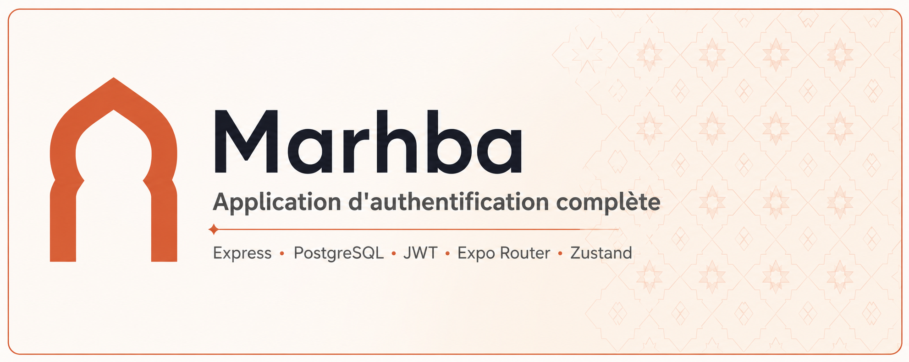

# Marhba — Application d'authentification complète



> **Marhba** signifie « bienvenue » en darija.
> Application mobile minimaliste démontrant le **circuit d'authentification complet**, du formulaire mobile jusqu'à la base PostgreSQL, avec **double protection des routes** : middlewares côté backend, `Stack.Protected` côté frontend.

> ⚠️ **Règle d'or du projet** : un écran protégé côté frontend ne suffit **jamais**. Si l'API n'est pas protégée par un middleware, n'importe qui peut lire les données avec Postman. La sécurité se fait toujours des deux côtés.

---

## Sommaire

- [Stack technique](#stack-technique)
- [Structure du projet](#structure-du-projet)
- [Prérequis](#prérequis)
- [Installation — Backend](#installation--backend)
- [Installation — Mobile](#installation--mobile)
- [Variables d'environnement](#variables-denvironnement)
- [API — Endpoints](#api--endpoints)
- [Middlewares](#middlewares)
- [Sécurité](#sécurité)
- [Protection des routes côté mobile](#protection-des-routes-côté-mobile)
- [Persistance de session](#persistance-de-session)
- [Tests Postman](#tests-postman)
- [Livrables](#livrables)
- [Auteur](#auteur)

---

## Stack technique

| Couche | Technologies |
|---|---|
| **Backend** | Node.js, Express, PostgreSQL, Sequelize, bcrypt, jsonwebtoken, dotenv |
| **Frontend** | Expo, Expo Router, Axios, Zustand, expo-secure-store |
| **Outils** | Postman, Git / GitHub, Jira |

---

## Structure du projet

```
marhba/
├── backend/
│   ├── config/
│   │   └── database.ts          # Instance Sequelize
│   ├── models/
│   │   └── User.ts              # Modèle User
│   ├── middlewares/
│   │   ├── logger.ts            # Log global (méthode + URL + timestamp)
│   │   ├── validate.ts          # validateRegister / validateLogin
│   │   ├── authenticate.ts      # Vérification du JWT → req.user
│   │   └── errorHandler.ts      # Gestion d'erreurs (4 paramètres)
│   ├── controllers/
│   │   └── authController.ts    # register / login / getMe
│   ├── routes/
│   │   └── authRoutes.ts
│   ├── postman/
│   │   └── marhba.postman_collection.json
│   ├── tsconfig.json
│   ├── .env.example
│   └── server.ts
│
├── mobile/
│   ├── app/
│   │   ├── _layout.jsx          # Stack.Protected (guards)
│   │   ├── (auth)/
│   │   │   ├── login.jsx
│   │   │   └── register.jsx
│   │   └── (app)/
│   │       └── home.jsx
│   ├── services/
│   │   └── api.js               # Instance Axios + intercepteurs
│   ├── store/
│   │   └── useAuthStore.js      # Zustand
│   └── app.json
│
└── README.md
```

---

## Prérequis

- Node.js ≥ 18
- PostgreSQL ≥ 14 — via Docker (recommandé) ou installation locale
- npm ou yarn
- Application **Expo Go** sur le téléphone (ou un émulateur Android / iOS)
- Le téléphone et l'ordinateur doivent être sur **le même réseau Wi-Fi**

> ⚠️ **Conflits de port fréquents sur macOS** :
> - Le port `5000` est souvent occupé par le récepteur AirPlay de macOS (Control Center) → le backend tourne par défaut sur `5001`.
> - Si un PostgreSQL est déjà installé en local (Homebrew, etc.) en plus du conteneur Docker, les deux vont se disputer le port `5432`. Dans ce cas, publiez le conteneur sur un autre port (ex. `5433`) et mettez à jour `DB_PORT` dans `.env` en conséquence.

---

## Installation — Backend

```bash
cd backend
npm install
```

### 1. Créer la base de données

Avec Docker (recommandé) :

```bash
docker run -d --name marhba-postgres \
  -e POSTGRES_USER=root \
  -e POSTGRES_PASSWORD=2026 \
  -e POSTGRES_DB=marhba \
  -p 5433:5432 \
  -v marhba_postgres_data:/var/lib/postgresql/data \
  postgres:16

# les lancements suivants :
docker start marhba-postgres
```

Ou avec un PostgreSQL installé en local :

```bash
createdb marhba_db
# ou depuis psql :
# CREATE DATABASE marhba_db;
```

### 2. Configurer l'environnement

```bash
cp .env.example .env
```

Remplir `.env` avec vos vraies valeurs (voir la section [Variables d'environnement](#variables-denvironnement)).

### 3. Lancer le serveur

```bash
npm run dev     # développement — tsx en mode watch (auto-reload)
npm run build   # compile le TypeScript dans dist/
npm start       # production — exécute dist/server.js
```

Le serveur démarre sur `http://localhost:5001` (voir `PORT` dans `.env`).
`sequelize.sync()` crée automatiquement la table `users` au premier lancement.

> Ne jamais lancer `node server.ts` directement — Node ne comprend pas TypeScript nativement. Toujours passer par `npm run dev`, `npx tsx server.ts`, ou par l'étape de build.

---

## Installation — Mobile

```bash
cd mobile
npm install
```

### 1. Configurer l'adresse de l'API

Dans `services/api.js`, remplacer l'IP par **l'adresse IP locale de votre machine** — `localhost` ne fonctionne pas depuis un téléphone physique.

```js
const api = axios.create({
  baseURL: "http://192.168.1.XX:5001/api",
});
```

Trouver son IP locale :

```bash
# macOS / Linux
ipconfig getifaddr en0     # ou : hostname -I

# Windows
ipconfig                   # → "Adresse IPv4"
```

### 2. Lancer l'application

```bash
npx expo start
```

Scanner le QR code avec Expo Go, ou appuyer sur `a` (Android) / `i` (iOS).

---

## Variables d'environnement

Fichier `backend/.env` — **jamais commité** (présent dans `.gitignore`).
Le fichier `backend/.env.example` est fourni sans les vraies valeurs.

| Variable | Description | Exemple |
|---|---|---|
| `PORT` | Port du serveur Express | `5001` (le `5000` entre souvent en conflit avec AirPlay sur macOS) |
| `DB_HOST` | Hôte PostgreSQL | `localhost` |
| `DB_PORT` | Port PostgreSQL | `5433` si Docker cohabite avec un PostgreSQL local (`5432` sinon) |
| `DB_NAME` | Nom de la base | `marhba` |
| `DB_USER` | Utilisateur PostgreSQL | `root` |
| `DB_PASSWORD` | Mot de passe PostgreSQL | `votre_mot_de_passe` |
| `JWT_SECRET` | Secret de signature des JWT | chaîne longue et aléatoire |
| `JWT_EXPIRES_IN` | Durée de validité du token | `7d` |

---

## API — Endpoints

Base URL : `http://localhost:5001/api`

| Méthode | Route | Accès | Description |
|---|---|---|---|
| `POST` | `/auth/register` | Publique | Inscription — hash du mot de passe, retourne un JWT |
| `POST` | `/auth/login` | Publique | Connexion — vérifie le hash, retourne un JWT |
| `GET` | `/auth/me` | 🔒 `authenticate` | Infos de l'utilisateur connecté, sans le mot de passe |

### `POST /api/auth/register`

**Requête**

```json
{
  "fullName": "Mohamed Harbouli",
  "email": "mohamed@example.com",
  "password": "azerty123"
}
```

**Réponse — 201**

```json
{
  "user": { "id": 1, "fullName": "Mohamed Harbouli", "email": "mohamed@example.com" },
  "token": "eyJhbGciOiJIUzI1NiIsInR5cCI6IkpXVCJ9..."
}
```

### `POST /api/auth/login`

**Requête**

```json
{ "email": "mohamed@example.com", "password": "azerty123" }
```

**Réponse — 200** : identique à `/register`.
**Réponse — 401** : `{ "error": "Email ou mot de passe incorrect" }`

### `GET /api/auth/me`

**Header requis**

```
Authorization: Bearer <token>
```

**Réponse — 200**

```json
{ "id": 1, "fullName": "Mohamed Harbouli", "email": "mohamed@example.com" }
```

**Réponse — 401** (sans token, token invalide ou expiré)

```json
{ "error": "Token manquant ou invalide" }
```

---

## Middlewares

| Middleware | Rôle |
|---|---|
| `logger` | Global. Affiche méthode + URL + timestamp de chaque requête. |
| `validateRegister` | Vérifie `fullName`, `email` valide, `password` ≥ 6 caractères → sinon `400`. |
| `validateLogin` | Vérifie la présence et le format des champs → sinon `400`. |
| `authenticate` | Lit `Authorization: Bearer <token>`, vérifie le JWT, attache `req.user` → sinon `401`. |
| `errorHandler` | Middleware d'erreur global (4 paramètres), monté en dernier, renvoie `{ "error": "..." }`. |

**Ordre de montage dans `server.ts` :**

```
logger  →  routes (validate → authenticate → controller)  →  errorHandler
```

> ⚠️ La vérification du token vit **uniquement** dans le middleware `authenticate`.
> Les controllers ne contiennent que la logique métier.

---

## Sécurité

- Mots de passe hashés avec `bcrypt.hash(password, 10)` — jamais stockés en clair
- Le mot de passe hashé n'apparaît **jamais** dans une réponse JSON
- `JWT_SECRET` vit dans `.env`, lui-même dans `.gitignore`
- Les JWT expirent (`expiresIn: "7d"`)
- Message d'erreur **identique** pour « email inexistant » et « mauvais mot de passe » :
  `"Email ou mot de passe incorrect"` — pour ne pas permettre l'énumération de comptes
- Le token est stocké côté mobile dans **`expo-secure-store`** (Keychain / Keystore), jamais dans AsyncStorage

---

## Protection des routes côté mobile

Dans `app/_layout.jsx`, les groupes de routes sont gardés par l'état d'authentification :

```jsx
<Stack>
  <Stack.Protected guard={isAuthenticated}>
    <Stack.Screen name="(app)" />
  </Stack.Protected>

  <Stack.Protected guard={!isAuthenticated}>
    <Stack.Screen name="(auth)" />
  </Stack.Protected>
</Stack>
```

**Comportements attendus**

| Situation | Résultat |
|---|---|
| Non connecté → `/home` | Redirection vers `/login` |
| Connecté → `/login` | Redirection vers `/home` |
| Après login / register réussi | Redirection automatique vers Accueil |
| Après déconnexion | Retour automatique à Connexion |

### Axios — instance et intercepteurs

`services/api.js` expose une instance unique avec `baseURL`.

- **Intercepteur de requête** : attache automatiquement `Authorization: Bearer <token>`.
  Aucun appel API n'ajoute ce header manuellement.
- **Intercepteur de réponse** : sur `401`, déclenche `logout()` — déconnexion automatique si le token a expiré.

---

## Persistance de session

Au lancement de l'application, `restoreSession()` :

1. Lit le token dans `expo-secure-store`
2. Appelle `GET /api/auth/me` pour **valider** ce token auprès du serveur
3. Met à jour le store Zustand (`user`, `token`, `isAuthenticated`)

Pendant cette vérification, un **écran de chargement** est affiché — pas de « flash » de l'écran de connexion.

### Store Zustand — `useAuthStore`

| État | Actions |
|---|---|
| `user`, `token`, `isAuthenticated`, `isLoading` | `register()`, `login()`, `logout()`, `restoreSession()` |

---

## Tests Postman

La collection exportée se trouve dans `backend/postman/`.

Elle couvre les 3 endpoints **avec et sans token** :

| # | Requête | Attendu |
|---|---|---|
| 1 | `POST /auth/register` — données valides | `201` + token |
| 2 | `POST /auth/register` — email déjà utilisé | `400` |
| 3 | `POST /auth/register` — password < 6 caractères | `400` |
| 4 | `POST /auth/login` — bons identifiants | `200` + token |
| 5 | `POST /auth/login` — mauvais identifiants | `401` |
| 6 | `GET /auth/me` — **avec** token | `200` |
| 7 | `GET /auth/me` — **sans** token | `401` |

> Le cas n°7 est la démonstration de la règle d'or : même si l'écran mobile est protégé,
> c'est le middleware `authenticate` qui empêche réellement l'accès aux données.

---

## Livrables

- [ ] Repo GitHub avec `backend/` et `mobile/` + ce README
- [ ] Fichier `.env.example` (sans les vraies valeurs)
- [ ] Collection Postman exportée (3 endpoints, avec et sans token)
- [ ] Démo vidéo 2–3 min : inscription → fermeture de l'app → réouverture (session restaurée) → déconnexion
- [ ] Tâches Jira à jour

---

## Auteur

**Mohamed Harbouli**
Projet réalisé dans le cadre du référentiel *[2023] Développeur web et web mobile*.
